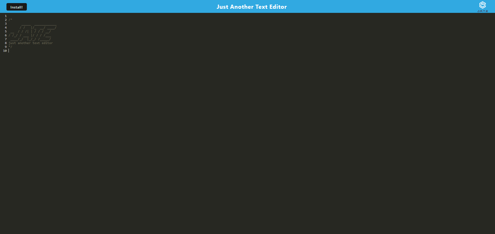

# pwa-text-editor

## pwa-text-editor

## Description

JATE (Just Another Text Editor) is a PWA (progressive web app) that allows users to enter notes and come back to them later without needing to specifically save or create files to come back to. This application uses various plugins to save entered information into the browsers indexedDb and load as you go.

Production Application: https://afternoon-anchorage-48593-517a6a8aa96e.herokuapp.com/

## Table of Contents

- [Installation](#installation)
- [Usage](#usage)
- [Contribution](#contribution)
- [Tests](#tests)
- [License](#license)
- [Questions](#questions)

## Installation

Since this application makes use of both a client and a server there are a few setup steps. First run "npm i" in order to install "concurrently," which will allow for the next script "npm install" to run properly. This will install all the necessary npm dependencies for both the client and the server in order for the application. For Development purposes simply run "npm run start:dev" and for production "npm run start."

Additionally once the app has been deployed you can install it from the browser using either the "Install" button on the page or through the address bar's installation icon. This will open the text editor in a new independent screen.

## Usage

Once the application has been deployed simply enter text into the text editor. On initial run you should see "JATE" in text format for the first 9 lines, with the 10th being your entry point to begin adding your own. The only thing needed here is to make the browser lose focus in order for the save to occur. Additionally you can install this application (since it is a PWA) to run in a separate window.

## Contribution

N/A

## Tests

No

## License

N/A

## Questions

You can reach me at danielwatkins@byu.net or find me at https://github.com/dan-watkins
